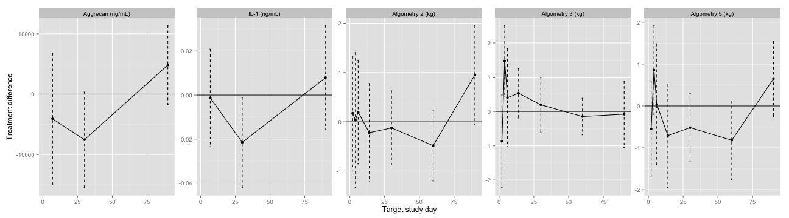

# Summary Statistics and Plots
- Report generated Sat Nov  9 19:48:18 2013

## Average treatment differences over horses

### Average treatment differences over horses
Fit a linear regression model, stratified by horse to acknowledge that each horse 
is both treated and not treated. 
$$ y_{ijk} = \mu_i + \beta x_j + \gamma b_{ij0} + \epsilon_{ijk} $$
where $y_{ijk}$ is the outcome measure $k$ for horse $i$ on the leg with treatment $x_j$.
$x_j = 0$ for not treated, and 1 for treated. $b_{ij0}$ is the baseline measurement of $y_{ijk}$, averaged over the measurements $k$.
$\epsilon_{ijk}$ is random error which we assume is normally distributed. 
$\beta$ is the mean treatment difference between treated and non-treated leg.

Perform this analysis for every time point for each variable

<!-- html table generated in R 3.0.1 by xtable 1.7-1 package -->
<!-- Sat Nov  9 19:48:43 2013 -->
<TABLE border=1>
<TR> <TH> Outcome </TH> <TH> Target study day </TH> <TH> Treatment difference </TH> <TH> CI </TH> <TH> P value </TH>  </TR>
  <TR> <TD> Aggrecan (ng/mL) </TD> <TD align="right"> 7 </TD> <TD align="right"> -4073 </TD> <TD align="right"> (-14920,   6774) </TD> <TD align="right"> 0.486 </TD> </TR>
  <TR> <TD> Aggrecan (ng/mL) </TD> <TD align="right"> 30 </TD> <TD align="right"> -7545 </TD> <TD align="right"> (-15441,    351) </TD> <TD align="right"> 0.103 </TD> </TR>
  <TR> <TD> Aggrecan (ng/mL) </TD> <TD align="right"> 90 </TD> <TD align="right"> 4829 </TD> <TD align="right"> (-1717, 11375) </TD> <TD align="right"> 0.191 </TD> </TR>
  <TR> <TD> IL-1 (ng/mL) </TD> <TD align="right"> 7 </TD> <TD align="right"> -0.00128 </TD> <TD align="right"> (-0.0234,  0.0208) </TD> <TD align="right"> 0.913 </TD> </TR>
  <TR> <TD> IL-1 (ng/mL) </TD> <TD align="right"> 30 </TD> <TD align="right"> -0.0215 </TD> <TD align="right"> (-0.04190, -0.00107) </TD> <TD align="right"> 0.0781 </TD> </TR>
  <TR> <TD> IL-1 (ng/mL) </TD> <TD align="right"> 90 </TD> <TD align="right"> 0.00793 </TD> <TD align="right"> (-0.0157,  0.0316) </TD> <TD align="right"> 0.532 </TD> </TR>
  <TR> <TD> Algometry 2 (kg) </TD> <TD align="right"> 2 </TD> <TD align="right"> 0.175 </TD> <TD align="right"> (-0.978,  1.329) </TD> <TD align="right"> 0.768 </TD> </TR>
  <TR> <TD> Algometry 2 (kg) </TD> <TD align="right"> 4 </TD> <TD align="right"> 0.0366 </TD> <TD align="right"> (-1.33,  1.41) </TD> <TD align="right"> 0.959 </TD> </TR>
  <TR> <TD> Algometry 2 (kg) </TD> <TD align="right"> 6 </TD> <TD align="right"> 0.196 </TD> <TD align="right"> (-0.857,  1.248) </TD> <TD align="right"> 0.719 </TD> </TR>
  <TR> <TD> Algometry 2 (kg) </TD> <TD align="right"> 14 </TD> <TD align="right"> -0.222 </TD> <TD align="right"> (-1.222,  0.777) </TD> <TD align="right"> 0.667 </TD> </TR>
  <TR> <TD> Algometry 2 (kg) </TD> <TD align="right"> 30 </TD> <TD align="right"> -0.125 </TD> <TD align="right"> (-0.878,  0.628) </TD> <TD align="right"> 0.748 </TD> </TR>
  <TR> <TD> Algometry 2 (kg) </TD> <TD align="right"> 60 </TD> <TD align="right"> -0.484 </TD> <TD align="right"> (-1.202,  0.234) </TD> <TD align="right"> 0.198 </TD> </TR>
  <TR> <TD> Algometry 2 (kg) </TD> <TD align="right"> 90 </TD> <TD align="right"> 0.953 </TD> <TD align="right"> (-0.0503,  1.9559) </TD> <TD align="right"> 0.0744 </TD> </TR>
  <TR> <TD> Algometry 3 (kg) </TD> <TD align="right"> 2 </TD> <TD align="right"> -0.867 </TD> <TD align="right"> (-2.216,  0.481) </TD> <TD align="right"> 0.219 </TD> </TR>
  <TR> <TD> Algometry 3 (kg) </TD> <TD align="right"> 4 </TD> <TD align="right"> 1.48 </TD> <TD align="right"> (0.446, 2.510) </TD> <TD align="right"> 0.00954 </TD> </TR>
  <TR> <TD> Algometry 3 (kg) </TD> <TD align="right"> 6 </TD> <TD align="right"> 0.404 </TD> <TD align="right"> (-1.02,  1.83) </TD> <TD align="right"> 0.584 </TD> </TR>
  <TR> <TD> Algometry 3 (kg) </TD> <TD align="right"> 14 </TD> <TD align="right"> 0.529 </TD> <TD align="right"> (-0.192,  1.250) </TD> <TD align="right"> 0.163 </TD> </TR>
  <TR> <TD> Algometry 3 (kg) </TD> <TD align="right"> 30 </TD> <TD align="right"> 0.196 </TD> <TD align="right"> (-0.602,  0.995) </TD> <TD align="right"> 0.634 </TD> </TR>
  <TR> <TD> Algometry 3 (kg) </TD> <TD align="right"> 60 </TD> <TD align="right"> -0.148 </TD> <TD align="right"> (-0.684,  0.387) </TD> <TD align="right"> 0.592 </TD> </TR>
  <TR> <TD> Algometry 3 (kg) </TD> <TD align="right"> 90 </TD> <TD align="right"> -0.0804 </TD> <TD align="right"> (-1.049,  0.888) </TD> <TD align="right"> 0.872 </TD> </TR>
  <TR> <TD> Algometry 5 (kg) </TD> <TD align="right"> 2 </TD> <TD align="right"> -0.549 </TD> <TD align="right"> (-1.696,  0.598) </TD> <TD align="right"> 0.357 </TD> </TR>
  <TR> <TD> Algometry 5 (kg) </TD> <TD align="right"> 4 </TD> <TD align="right"> 0.859 </TD> <TD align="right"> (-0.204,  1.923) </TD> <TD align="right"> 0.126 </TD> </TR>
  <TR> <TD> Algometry 5 (kg) </TD> <TD align="right"> 6 </TD> <TD align="right"> 0.0417 </TD> <TD align="right"> (-1.40,  1.49) </TD> <TD align="right"> 0.955 </TD> </TR>
  <TR> <TD> Algometry 5 (kg) </TD> <TD align="right"> 14 </TD> <TD align="right"> -0.709 </TD> <TD align="right"> (-1.945,  0.528) </TD> <TD align="right"> 0.272 </TD> </TR>
  <TR> <TD> Algometry 5 (kg) </TD> <TD align="right"> 30 </TD> <TD align="right"> -0.518 </TD> <TD align="right"> (-1.333,  0.297) </TD> <TD align="right"> 0.225 </TD> </TR>
  <TR> <TD> Algometry 5 (kg) </TD> <TD align="right"> 60 </TD> <TD align="right"> -0.819 </TD> <TD align="right"> (-1.761,  0.122) </TD> <TD align="right"> 0.101 </TD> </TR>
  <TR> <TD> Algometry 5 (kg) </TD> <TD align="right"> 90 </TD> <TD align="right"> 0.647 </TD> <TD align="right"> (-0.255,  1.548) </TD> <TD align="right"> 0.172 </TD> </TR>
   </TABLE>
 

