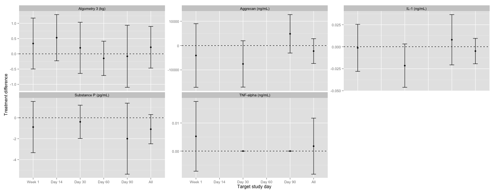

# Analysis
- Report generated Sun Nov 24 22:47:03 2013

## Average treatment differences over horses

### Table and plot of summary data

<!-- html table generated in R 3.0.1 by xtable 1.7-1 package -->
<!-- Sun Nov 24 22:47:10 2013 -->
<TABLE border=1>
<TR> <TH> Outcome </TH> <TH> Treatment </TH> <TH> Median Day 0 </TH> <TH> Mean Day 0 </TH> <TH> Range Day 0 </TH> <TH> Median Week 1 </TH> <TH> Mean Week 1 </TH> <TH> Range Week 1 </TH> <TH> Median Day 14 </TH> <TH> Mean Day 14 </TH> <TH> Range Day 14 </TH> <TH> Median Day 30 </TH> <TH> Mean Day 30 </TH> <TH> Range Day 30 </TH> <TH> Median Day 60 </TH> <TH> Mean Day 60 </TH> <TH> Range Day 60 </TH> <TH> Median Day 90 </TH> <TH> Mean Day 90 </TH> <TH> Range Day 90 </TH>  </TR>
  <TR> <TD> Algometry 3 (kg) </TD> <TD align="right"> Sham treated </TD> <TD align="right"> 12 </TD> <TD align="right"> 11.2 </TD> <TD align="right"> (8.5, 12) </TD> <TD align="right"> 8.5 </TD> <TD align="right"> 8.81 </TD> <TD align="right"> (4.9, 12) </TD> <TD align="right"> 10.2 </TD> <TD align="right"> 9.7 </TD> <TD align="right"> (6.2, 12) </TD> <TD align="right"> 10.9 </TD> <TD align="right"> 10.6 </TD> <TD align="right"> (8.6, 12) </TD> <TD align="right"> 11.8 </TD> <TD align="right"> 11.3 </TD> <TD align="right"> (9.4, 12) </TD> <TD align="right"> 11.1 </TD> <TD align="right"> 10.6 </TD> <TD align="right"> (7.7, 12) </TD> </TR>
  <TR> <TD> Algometry 3 (kg) </TD> <TD align="right"> Treated </TD> <TD align="right"> 12 </TD> <TD align="right"> 10.6 </TD> <TD align="right"> (5.9, 12) </TD> <TD align="right"> 9.4 </TD> <TD align="right"> 8.63 </TD> <TD align="right"> (4.75, 10.4) </TD> <TD align="right"> 12 </TD> <TD align="right"> 9.89 </TD> <TD align="right"> (5.9, 12) </TD> <TD align="right"> 11.3 </TD> <TD align="right"> 10.5 </TD> <TD align="right"> (7.9, 12) </TD> <TD align="right"> 12 </TD> <TD align="right"> 11.1 </TD> <TD align="right"> (7.8, 12) </TD> <TD align="right"> 11.7 </TD> <TD align="right"> 10.3 </TD> <TD align="right"> (6.3, 12) </TD> </TR>
  <TR> <TD> Lameness sym (score) </TD> <TD align="right"> Whole horse </TD> <TD align="right"> 1.01 </TD> <TD align="right"> 1.04 </TD> <TD align="right"> (0.9, 1.22) </TD> <TD align="right"> 1 </TD> <TD align="right"> 1.04 </TD> <TD align="right"> (0.7, 1.75) </TD> <TD align="right"> 1.09 </TD> <TD align="right"> 1.07 </TD> <TD align="right"> (0.65, 1.65) </TD> <TD align="right"> 0.87 </TD> <TD align="right"> 0.948 </TD> <TD align="right"> (0.75, 1.27) </TD> <TD align="right"> 1.1 </TD> <TD align="right"> 1.01 </TD> <TD align="right"> (0.52, 1.37) </TD> <TD align="right"> 1 </TD> <TD align="right"> 1 </TD> <TD align="right"> (0.87, 1.18) </TD> </TR>
  <TR> <TD> Aggrecan (ng/mL) </TD> <TD align="right"> Sham treated </TD> <TD align="right"> 6276 </TD> <TD align="right"> 9472 </TD> <TD align="right"> (5340, 24079) </TD> <TD align="right"> 8734 </TD> <TD align="right"> 15316 </TD> <TD align="right"> (4818, 50844) </TD> <TD align="right">  </TD> <TD align="right">  </TD> <TD align="right">  </TD> <TD align="right"> 10775 </TD> <TD align="right"> 13900 </TD> <TD align="right"> (5798, 37405) </TD> <TD align="right">  </TD> <TD align="right">  </TD> <TD align="right">  </TD> <TD align="right"> 8400 </TD> <TD align="right"> 8508 </TD> <TD align="right"> (3252, 15263) </TD> </TR>
  <TR> <TD> Aggrecan (ng/mL) </TD> <TD align="right"> Treated </TD> <TD align="right"> 9716 </TD> <TD align="right"> 11027 </TD> <TD align="right"> (5476, 20629) </TD> <TD align="right"> 8220 </TD> <TD align="right"> 11665 </TD> <TD align="right"> (5226, 21569) </TD> <TD align="right">  </TD> <TD align="right">  </TD> <TD align="right">  </TD> <TD align="right"> 6229 </TD> <TD align="right"> 7076 </TD> <TD align="right"> (3416, 13156) </TD> <TD align="right">  </TD> <TD align="right">  </TD> <TD align="right">  </TD> <TD align="right"> 8439 </TD> <TD align="right"> 12980 </TD> <TD align="right"> (3149, 30277) </TD> </TR>
  <TR> <TD> IL-1 (ng/mL) </TD> <TD align="right"> Sham treated </TD> <TD align="right"> 0.128 </TD> <TD align="right"> 0.124 </TD> <TD align="right"> (0.061, 0.186) </TD> <TD align="right"> 0.105 </TD> <TD align="right"> 0.123 </TD> <TD align="right"> (0.09, 0.211) </TD> <TD align="right">  </TD> <TD align="right">  </TD> <TD align="right">  </TD> <TD align="right"> 0.132 </TD> <TD align="right"> 0.136 </TD> <TD align="right"> (0.107, 0.196) </TD> <TD align="right">  </TD> <TD align="right">  </TD> <TD align="right">  </TD> <TD align="right"> 0.087 </TD> <TD align="right"> 0.111 </TD> <TD align="right"> (0.063, 0.198) </TD> </TR>
  <TR> <TD> IL-1 (ng/mL) </TD> <TD align="right"> Treated </TD> <TD align="right"> 0.126 </TD> <TD align="right"> 0.128 </TD> <TD align="right"> (0.09, 0.168) </TD> <TD align="right"> 0.128 </TD> <TD align="right"> 0.122 </TD> <TD align="right"> (0.079, 0.192) </TD> <TD align="right">  </TD> <TD align="right">  </TD> <TD align="right">  </TD> <TD align="right"> 0.105 </TD> <TD align="right"> 0.114 </TD> <TD align="right"> (0.066, 0.161) </TD> <TD align="right">  </TD> <TD align="right">  </TD> <TD align="right">  </TD> <TD align="right"> 0.109 </TD> <TD align="right"> 0.116 </TD> <TD align="right"> (0.066, 0.154) </TD> </TR>
  <TR> <TD> TNF-alpha (ng/mL) </TD> <TD align="right"> Sham treated </TD> <TD align="right"> 0 </TD> <TD align="right"> 0.00767 </TD> <TD align="right"> (0, 0.069) </TD> <TD align="right"> 0 </TD> <TD align="right"> 0.0334 </TD> <TD align="right"> (0, 0.301) </TD> <TD align="right">  </TD> <TD align="right">  </TD> <TD align="right">  </TD> <TD align="right"> 0 </TD> <TD align="right"> 0.0376 </TD> <TD align="right"> (0, 0.338) </TD> <TD align="right">  </TD> <TD align="right">  </TD> <TD align="right">  </TD> <TD align="right"> 0 </TD> <TD align="right"> 0.0227 </TD> <TD align="right"> (0, 0.204) </TD> </TR>
  <TR> <TD> TNF-alpha (ng/mL) </TD> <TD align="right"> Treated </TD> <TD align="right"> 0 </TD> <TD align="right"> 0.0101 </TD> <TD align="right"> (0, 0.091) </TD> <TD align="right"> 0 </TD> <TD align="right"> 0.0378 </TD> <TD align="right"> (0, 0.298) </TD> <TD align="right">  </TD> <TD align="right">  </TD> <TD align="right">  </TD> <TD align="right"> 0 </TD> <TD align="right"> 0.0301 </TD> <TD align="right"> (0, 0.271) </TD> <TD align="right">  </TD> <TD align="right">  </TD> <TD align="right">  </TD> <TD align="right"> 0 </TD> <TD align="right"> 0.0256 </TD> <TD align="right"> (0, 0.23) </TD> </TR>
  <TR> <TD> Substance P (pg/mL) </TD> <TD align="right"> Sham treated </TD> <TD align="right"> 8 </TD> <TD align="right"> 8.33 </TD> <TD align="right"> (5, 13) </TD> <TD align="right"> 8 </TD> <TD align="right"> 9.67 </TD> <TD align="right"> (5, 18) </TD> <TD align="right">  </TD> <TD align="right">  </TD> <TD align="right">  </TD> <TD align="right"> 8 </TD> <TD align="right"> 8.22 </TD> <TD align="right"> (6, 12) </TD> <TD align="right">  </TD> <TD align="right">  </TD> <TD align="right">  </TD> <TD align="right"> 7 </TD> <TD align="right"> 8.89 </TD> <TD align="right"> (5, 18) </TD> </TR>
  <TR> <TD> Substance P (pg/mL) </TD> <TD align="right"> Treated </TD> <TD align="right"> 7 </TD> <TD align="right"> 7.33 </TD> <TD align="right"> (6, 9) </TD> <TD align="right"> 8 </TD> <TD align="right"> 9 </TD> <TD align="right"> (5, 18) </TD> <TD align="right">  </TD> <TD align="right">  </TD> <TD align="right">  </TD> <TD align="right"> 7 </TD> <TD align="right"> 8 </TD> <TD align="right"> (5, 14) </TD> <TD align="right">  </TD> <TD align="right">  </TD> <TD align="right">  </TD> <TD align="right"> 6 </TD> <TD align="right"> 7.67 </TD> <TD align="right"> (4, 16) </TD> </TR>
   </TABLE>
 

### Model average treatment differences over horses
#### Model each time point
Fit a linear regression model, stratified by horse to acknowledge that each horse 
is both treated and not treated. 
$$ y_{ijk} = \mu_i + \beta x_j + \gamma b_{ij0} + \epsilon_{ijk} $$
where $y_{ijk}$ is the outcome measure $k$ for horse $i$ on the leg with treatment $x_j$.
$x_j = 0$ for not treated, and 1 for treated. $b_{ij0}$ is the baseline of horse $i$, on the leg with treatment $x_j$, averaged over the measurements $k$.
$\epsilon_{ijk}$ is random error which we assume is normally distributed. 
$\beta$ is the mean treatment difference between treated and non-treated leg.

Perform this analysis for every time point for each variable

#### Longitudinal model
Fit a linear regression model.
Stratify by horse to acknowledge that each horse is both treated and not treated, 
Include a between horse random effects for the treatment effect to
acknowledge that treatment effects from one horse over time are more similar than treatment effects from a different horse.
$$
\begin{aligned}
  y_{ijkl} &= \mu_i + (\beta + \beta_i) x_j + \gamma b_{ij0} + \epsilon_{ijkl} \\
  \beta_i &\sim N(0, \sigma_\beta^2) \\
  \epsilon_{ijkl} &\sim N(0, \sigma^2)
\end{aligned}
$$

where $y_{ijkl}$ is the outcome measure $k$ for horse $i$ on the leg with treatment $x_j$, at time $l$.
$x_j = 0$ for not treated, and 1 for treated. $b_{ij0}$ is the baseline measurement of horse $i$, on the leg with treatment $x_j$, averaged over the measurements $k$.
$\epsilon_{ijk}$ is random error which we assume is normally distributed. 
$\beta$ is the mean treatment difference between treated and non-treated leg.
$\beta_i$ is the horse specific random effect, giving the treatment difference between treated and non-treated leg over time for horse $i$.

Perform this analysis for each variable.

<!-- html table generated in R 3.0.1 by xtable 1.7-1 package -->
<!-- Sun Nov 24 22:47:15 2013 -->
<TABLE border=1>
<TR> <TH> Outcome </TH> <TH> Treatment difference Week 1 </TH> <TH> CI Week 1 </TH> <TH> P value Week 1 </TH> <TH> Treatment difference Day 14 </TH> <TH> CI Day 14 </TH> <TH> P value Day 14 </TH> <TH> Treatment difference Day 30 </TH> <TH> CI Day 30 </TH> <TH> P value Day 30 </TH> <TH> Treatment difference Day 60 </TH> <TH> CI Day 60 </TH> <TH> P value Day 60 </TH> <TH> Treatment difference Day 90 </TH> <TH> CI Day 90 </TH> <TH> P value Day 90 </TH> <TH> Treatment difference All </TH> <TH> CI All </TH> <TH> P value All </TH>  </TR>
  <TR> <TD> Algometry 3 (kg) </TD> <TD align="right"> 0.338 </TD> <TD align="right"> (-0.496, 1.17) </TD> <TD align="right"> 0.423 </TD> <TD align="right"> 0.529 </TD> <TD align="right"> (-0.228, 1.29) </TD> <TD align="right"> 0.163 </TD> <TD align="right"> 0.196 </TD> <TD align="right"> (-0.643, 1.04) </TD> <TD align="right"> 0.634 </TD> <TD align="right"> -0.148 </TD> <TD align="right"> (-0.711, 0.414) </TD> <TD align="right"> 0.592 </TD> <TD align="right"> -0.0804 </TD> <TD align="right"> (-1.1, 0.937) </TD> <TD align="right"> 0.872 </TD> <TD align="right"> 0.216 </TD> <TD align="right"> (-0.467, 0.899) </TD> <TD align="right"> 0.536 </TD> </TR>
  <TR> <TD> Aggrecan (ng/mL) </TD> <TD align="right"> -4073 </TD> <TD align="right"> (-17159, 9013) </TD> <TD align="right"> 0.486 </TD> <TD align="right">  </TD> <TD align="right">  </TD> <TD align="right">  </TD> <TD align="right"> -7545 </TD> <TD align="right"> (-17072, 1981) </TD> <TD align="right"> 0.103 </TD> <TD align="right">  </TD> <TD align="right">  </TD> <TD align="right">  </TD> <TD align="right"> 4829 </TD> <TD align="right"> (-3069, 12726) </TD> <TD align="right"> 0.191 </TD> <TD align="right"> -2263 </TD> <TD align="right"> (-7356, 2830) </TD> <TD align="right"> 0.389 </TD> </TR>
  <TR> <TD> IL-1 (ng/mL) </TD> <TD align="right"> -0.00128 </TD> <TD align="right"> (-0.028, 0.0254) </TD> <TD align="right"> 0.913 </TD> <TD align="right">  </TD> <TD align="right">  </TD> <TD align="right">  </TD> <TD align="right"> -0.0215 </TD> <TD align="right"> (-0.0461, 0.00315) </TD> <TD align="right"> 0.0781 </TD> <TD align="right">  </TD> <TD align="right">  </TD> <TD align="right">  </TD> <TD align="right"> 0.00793 </TD> <TD align="right"> (-0.0206, 0.0365) </TD> <TD align="right"> 0.532 </TD> <TD align="right"> -0.00495 </TD> <TD align="right"> (-0.0193, 0.00944) </TD> <TD align="right"> 0.504 </TD> </TR>
  <TR> <TD> Substance P (pg/mL) </TD> <TD align="right"> -0.889 </TD> <TD align="right"> (-3.34, 1.56) </TD> <TD align="right"> 0.419 </TD> <TD align="right">  </TD> <TD align="right">  </TD> <TD align="right">  </TD> <TD align="right"> -0.389 </TD> <TD align="right"> (-1.98, 1.2) </TD> <TD align="right"> 0.582 </TD> <TD align="right">  </TD> <TD align="right">  </TD> <TD align="right">  </TD> <TD align="right"> -2 </TD> <TD align="right"> (-5.4, 1.4) </TD> <TD align="right"> 0.206 </TD> <TD align="right"> -1.09 </TD> <TD align="right"> (-2.49, 0.306) </TD> <TD align="right"> 0.133 </TD> </TR>
  <TR> <TD> TNF-alpha (ng/mL) </TD> <TD align="right"> 0.00525 </TD> <TD align="right"> (-0.00716, 0.0177) </TD> <TD align="right"> 0.351 </TD> <TD align="right">  </TD> <TD align="right">  </TD> <TD align="right">  </TD> <TD align="right"> -2.94e-17 </TD> <TD align="right"> (-1.03e-16, 4.43e-17) </TD> <TD align="right"> 0.377 </TD> <TD align="right">  </TD> <TD align="right">  </TD> <TD align="right">  </TD> <TD align="right"> -2.04e-18 </TD> <TD align="right"> (-9.71e-18, 5.62e-18) </TD> <TD align="right"> 0.548 </TD> <TD align="right"> 0.00175 </TD> <TD align="right"> (-0.00822, 0.0117) </TD> <TD align="right"> 0.733 </TD> </TR>
   </TABLE>
 

