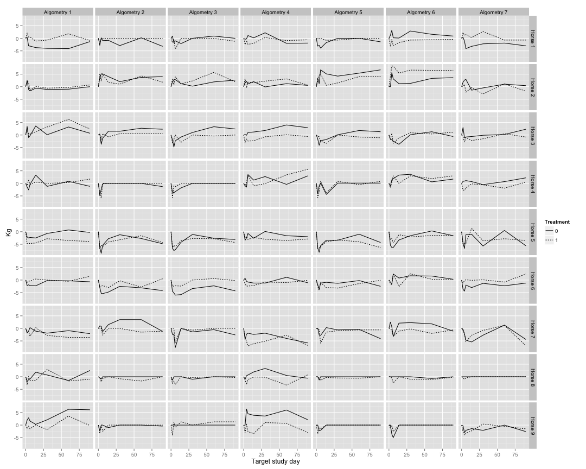
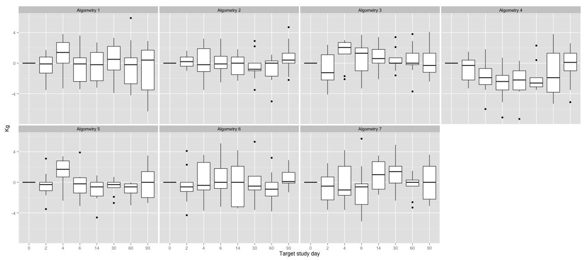
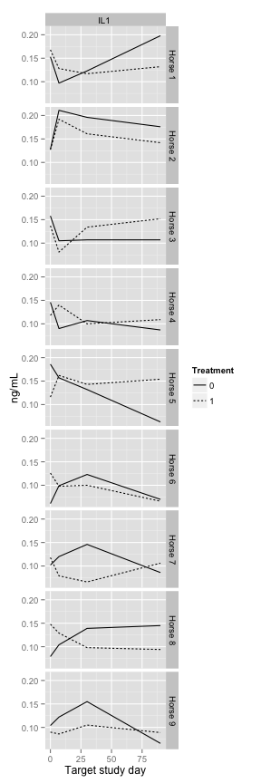
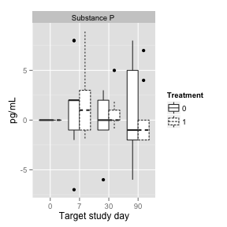
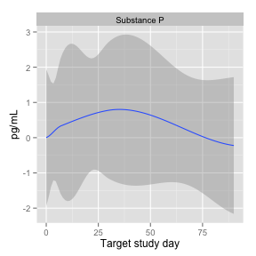
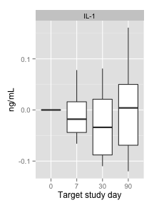

# Exploratory Plots
- Report generated Sat Nov  9 19:45:58 2013

## Algometry

### Value over time

 

### Change from baseline, for each treatment

 

### Change from baseline, for each treatment, averaged over horses, smoothed plot

 

### Change from baseline, for each treatment, averaged over horses, boxplot

 

### Within horse differences
This is the treatment effect for each horse
Positive value = treated leg has higher value

 

### Within horse differences, change from baseline
This is the treatment effect for each horse
Positive value = treated leg has higher value

 

### Within horse differences, change from baseline, averaged over horses
Positive value = treated leg has higher value
Loess smoother

 

Box plot

 

## Other measures

### Value over time

       

### Change from baseline, for each treatment

       

Loess smoother

       

Box plots

       

### Within horse differences
This is the treatment effect for each horse
Positive value = treated leg has higher value

       

### Within horse differences, change from baseline
This is the treatment effect for each horse
Positive value = treated leg has higher value

       

Loess smoother

       

Box plot

       

## Lameness Flex

 

## Lameness subjective

 

## Palpatation

 

## Swelling subjective

 

## Lameness Sym
### Value over time

 

